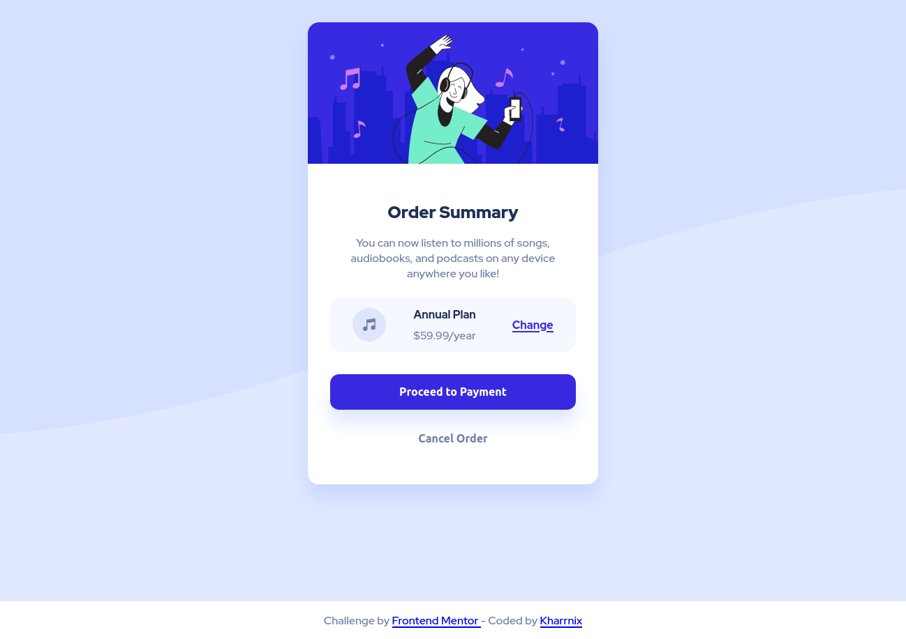

# Frontend Mentor - Order summary card solution

This is a solution to the [Order summary card challenge on Frontend Mentor](https://www.frontendmentor.io/challenges/order-summary-component-QlPmajDUj).

## Table of contents

- [Overview](#overview)
  - [The challenge](#the-challenge)
  - [Screenshot](#screenshot)
  - [Links](#links)
- [My process](#my-process)
  - [Built with](#built-with)
  - [What I learned](#what-i-learned)
  - [Useful resources](#useful-resources)
- [Author](#author)

## Overview

### The challenge

Users should be able to:

- See hover states for interactive elements

### Screenshot

### Links

- Solution URL: 
- Live Site URL: 

## My process

### Built with

- Flexbox
- Mobile-first workflow

### What I learned

The `clamp()` function in CSS is really useful for making things responsive; I used it on the card to make sure it didn't get too big on larger screens.

### Useful resources

- [W3Schools](https://w3schools.com) - Great website for HTML, CSS and
    JavaScript references

## Author

- Frontend Mentor - [@kharrnix](https://www.frontendmentor.io/profile/kharrnix)

